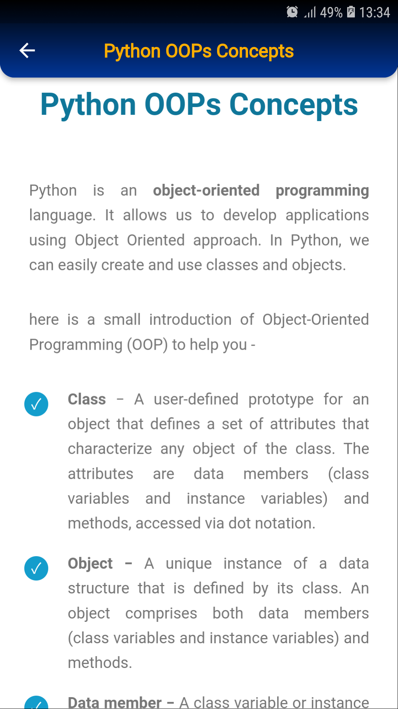

# Python Textbook


## Overview

Welcome to the Python Learning Textbook! This comprehensive resource is designed to take learners from absolute beginners to Python masters, covering a wide range of topics, including algorithms and data structures.

## Screenshots





## Getting Started

To run the app locally, follow these steps:

1. Clone the repository:

    ```bash
    git clone https://github.com/shatlyk-jr/py-book.git
    ```

2. Navigate to the project directory:

    ```bash
    cd py-book
    ```

3. Install dependencies:

    ```bash
    flutter pub get
    ```

4. Run the app:

    ```bash
    flutter run
    ```
